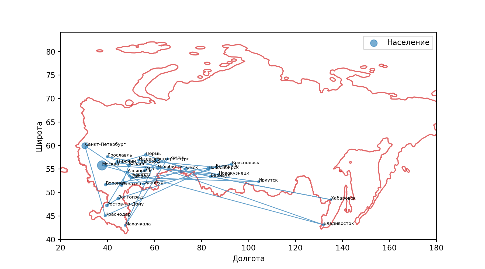
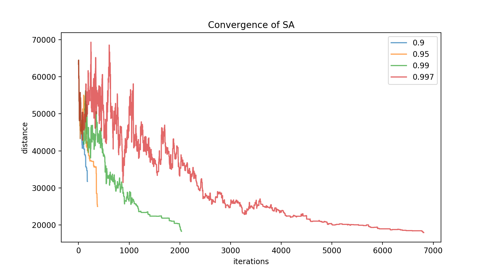
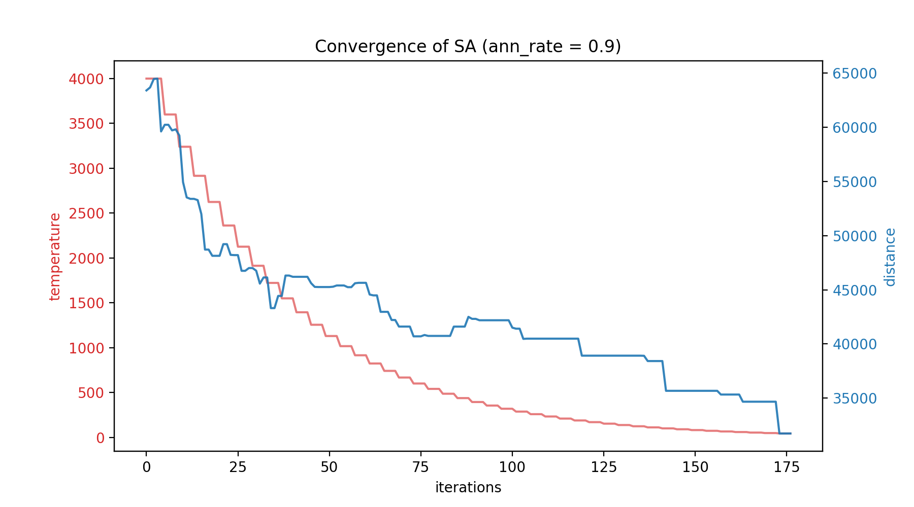
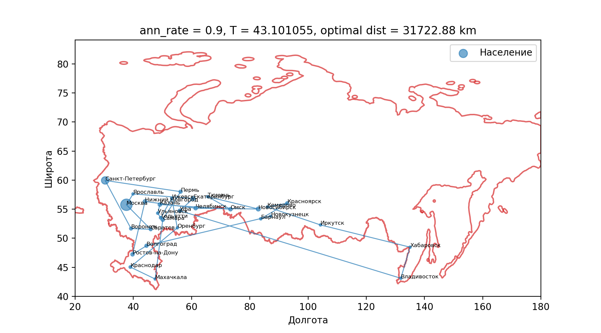
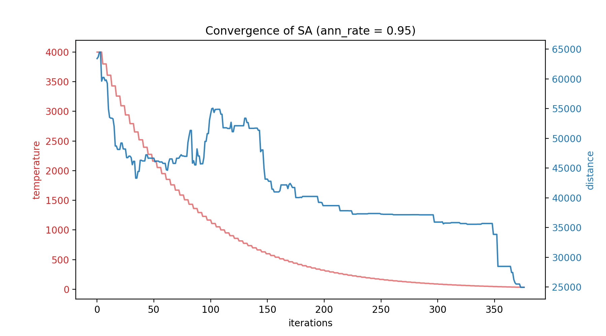
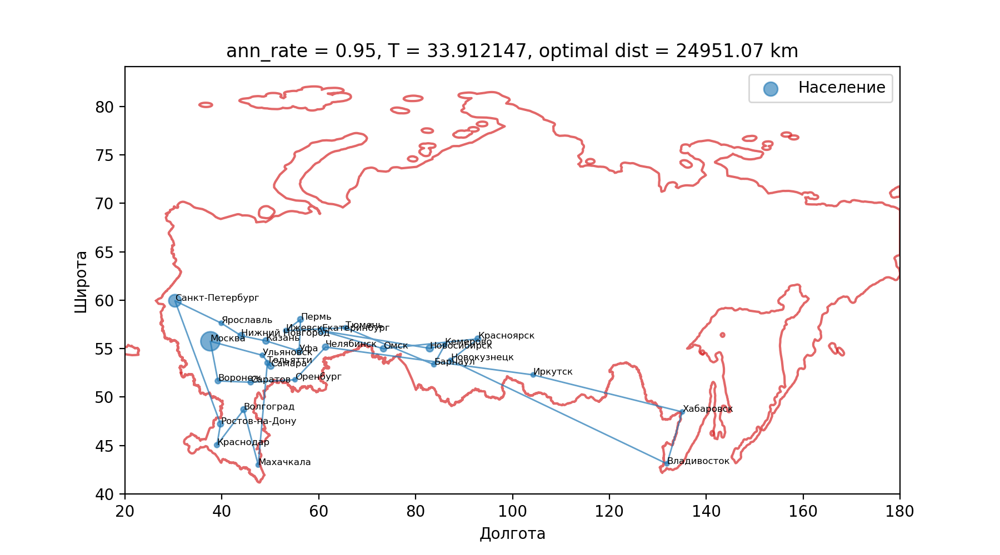
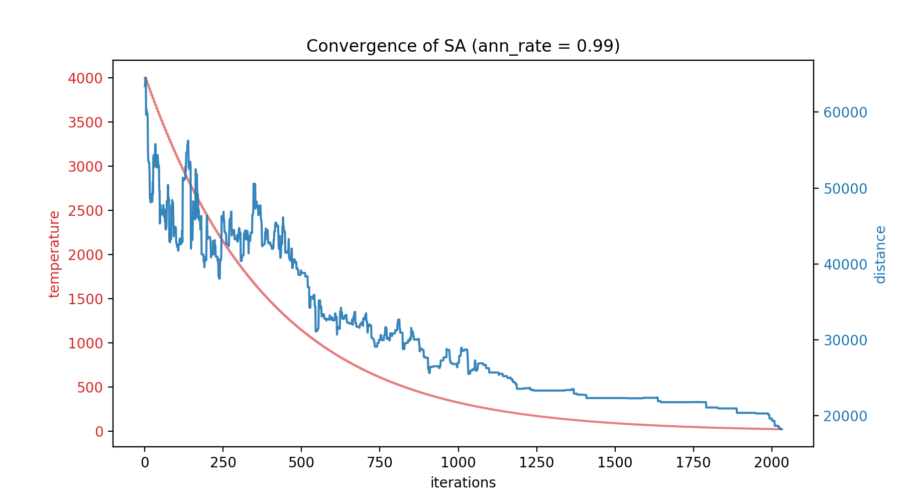
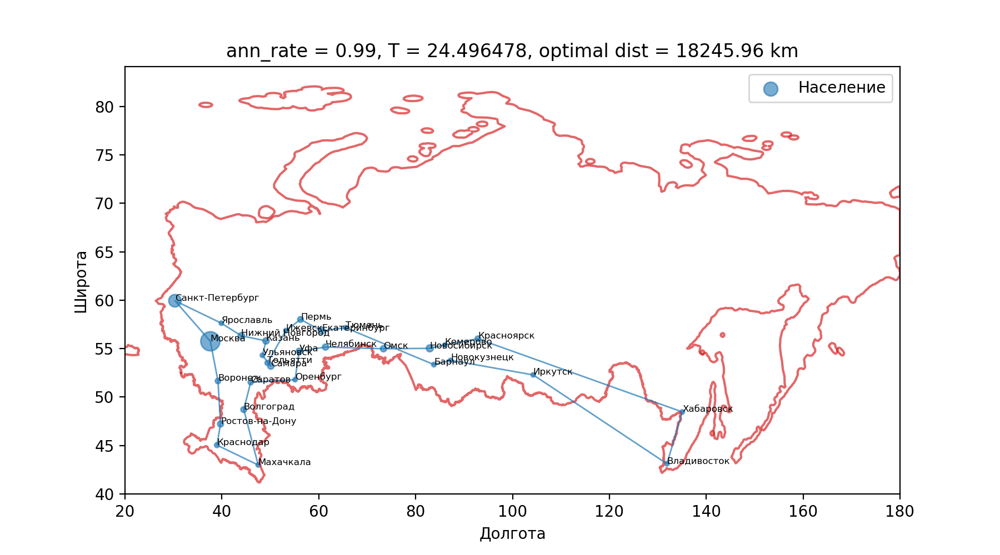
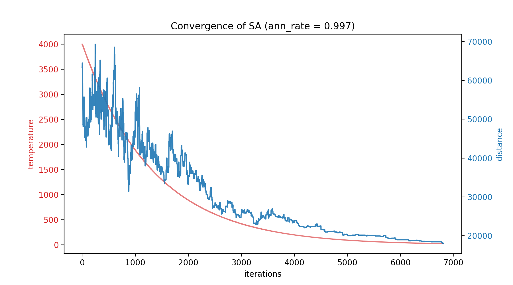

# Simulated Annealing

> Author: Ilya Borovik, BS4-DS

Application of Simulated Annealing to the Travelling Salesman problem
as a solution to Assignment #2 in Advanced Statistics course at Innopolis University.

The task is to solve Traveling Salesman problem for the 30 most popular Russian cities.

> [Report link](https://v2.overleaf.com/read/vqjqddbtgmpk)

> [Images and plots](results/images)

> [Video animations](results/videos)

## Installation 
To run the code yourself:
* clone repository using `git clone https://github.com/ilya16/simulated-annealing`
* install dependencies using `pip install -r requirements.txt`

## Dataset

[Initial dataset](https://gist.github.com/nalgeon/5307af065ff0e3bc97927c832fabe26b) 
contains a description of all cities in Russia. 
The top 30 cities are chosen by the population.

## Simulated Annealing algorithm notes
SA implementation follows the notes from the [Task](https://hackmd.io/s/r1WGbzm6Q). 
A few considerations are made to improve performance:
* Path distances are computer in constant `O(1)` time by observing the fact 
that two successive paths `x_n` and `x_t` differ only in two positions.
* Early stopping is used when acceptance ratio `alpha` becomes equal to `np.nan`.
Acceptable `non-nan` paths are observed and one of them is chosen at random to continue the search.
When all possible paths cannot be accepted (`alpha=np.nan`), algorithm ends execution.
A more detailed description is available in [report](https://v2.overleaf.com/read/vqjqddbtgmpk)

## Experimental setup

Simulated Annealing is compared for four different values of annealing rate: 
`0.9` (fast), `0.95` (middle), `0.99` (slow) and `0.997` (very slow). 

For each experiment run the same initial path is used:

 

## Results

Distances of optimal paths for each annealing rate and 
number of taken iterations are shown in the table below:

| Annealing Rate | # of iterations | Optimal path distance |
| ---------------|:---------------:|:---------------------:|
| 0.9            | 177             | 31722.88 km           |
| 0.95           | 377             | 24951.07 km           |
| 0.99           | 2033            | 18245.96 km           |
| 0.997          | 6813            | 17908.49 km           |

Combined convergence rates plot:

Convergence rates and optimal paths for each annealing rate are shown below.

### Fast cooling (`ann_rate=0.9`)

> [Convergence animation](results/videos/fast_09_country.mp4)

 

### Middle cooling (`ann_rate=0.95`)

> [Convergence animation](results/videos/mid_095_country.mp4)

### Slow cooling (`ann_rate=0.99`)

> [Convergence animation](results/videos/slow_099_country.mp4)

### Very Slow cooling (`ann_rate=0.997`)

> [Convergence animation](results/videos/slow_0997_country.mp4)

## Conclusion
Simulated Annealing can indeed solve the Traveling Salesman problem 
and find optimal (to some extend) solutions in a small amount of time.

Slow cooling in SA converges to a better solution, however, 
results may depend on the pseudo random procedure of sampling the next path 
from the distribution of paths.

